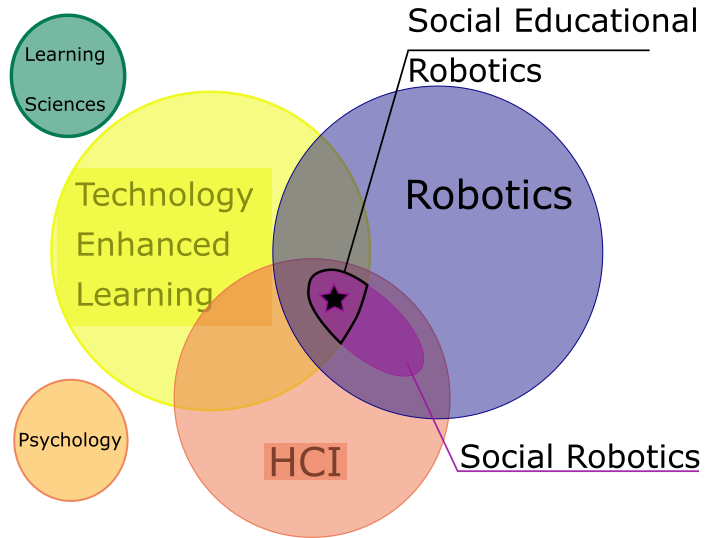

# Dataset and Analysis for Systematic Review of Social Robots for Education

Code accompaninig Current Robotics Report from the Topical Collection on Service and Interactive Robotics. 
Paper link: https://link.springer.com/article/10.1007/s43154-020-00008-3 

--- 

## Introduction

Based on Belpaeme et al. 2018, we propose an updated and ovel analysis of the litterature of social robots for leanring. 
Thie repo contains the code used to generate the figures for the paper "Research Trends in Social Robots for Learning" as well as the annotated dataset used for the analysis. 

## Usage

### Prereqs

### Data

### Running the notebook for analysis

1. To run jupyter without poetry::

	jupyter-lab

2. To run jupyter with poetry::

	poetry run jupyter-lab

Enjoy!

## References

- Johal, W. Research Trends in Social Robots for Learning. Curr Robot Rep (2020). https://doi.org/10.1007/s43154-020-00008-3
- Belpaeme, T., Kennedy, J., Ramachandran, A., Scassellati, B., & Tanaka, F. (2018). Social robots for education: A review. Science robotics, 3(21). https://robotics.sciencemag.org/content/3/21/eaat5954
